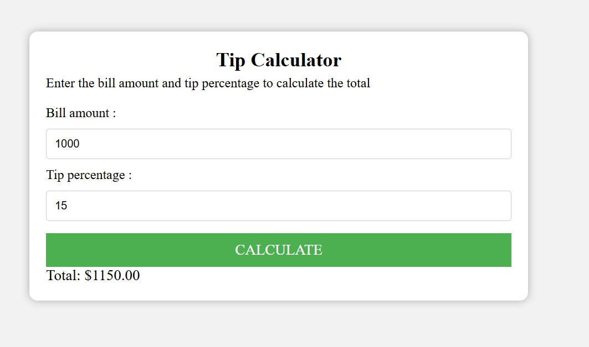

## 💰 Tip Calculator  

A **Tip Calculator** built using HTML, CSS, and JavaScript. Quickly calculate the tip amount and total bill based on the entered bill amount and tip percentage. Perfect for restaurants, cafes, and group dining!  

## 🚀 Features  
- ✅ Calculates **tip amount** based on the selected percentage  
- ✅ Displays **total bill** (bill + tip) instantly  
- ✅ Simple, fast, and user-friendly interface  

## 🛠 Tech Stack  
HTML, CSS, JavaScript  

## 📷 Screenshots  
  

## 📌 How It Works  
1. Enter the **bill amount** in the input field.  
2. Select a **tip percentage** (e.g., 10%, 15%, 20%).   
4. Instantly view the **total amount**.  

## 📥 Download & Installation  
Clone the repository using Git:  
```bash
git clone https://github.com/aklema094/Tip-Calculator.git
```  
Or download the ZIP file manually from [here](https://github.com/aklema094/Tip-Calculator/archive/refs/heads/main.zip). 